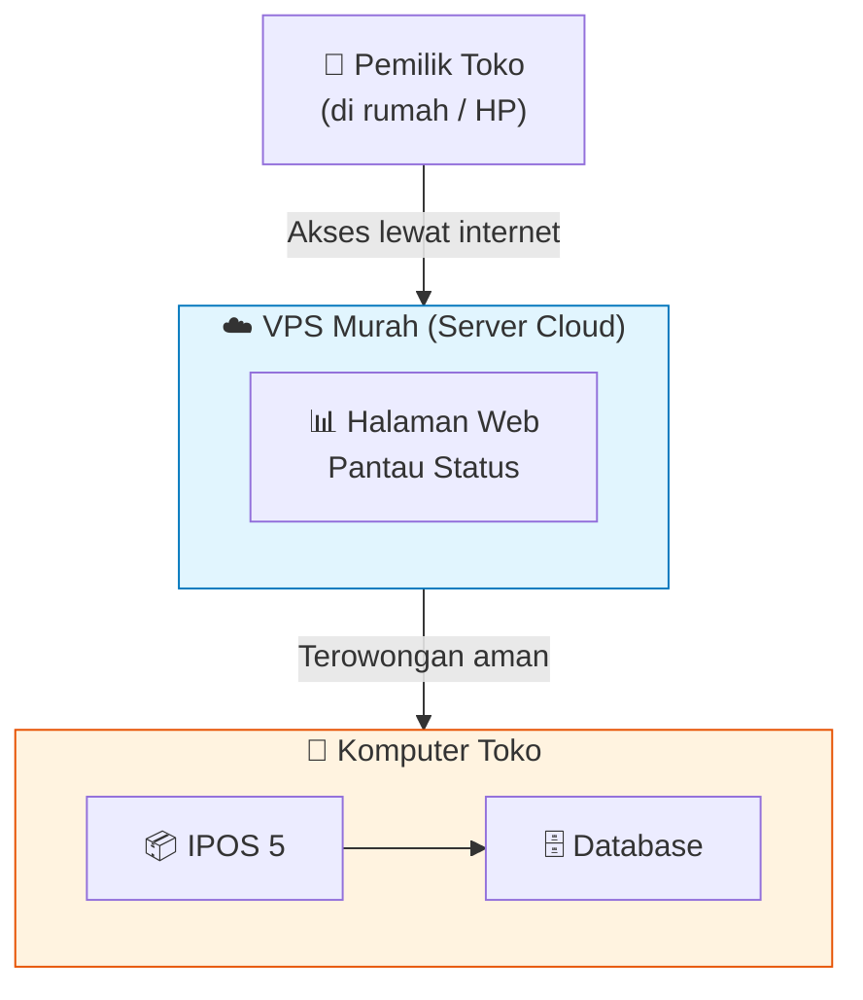
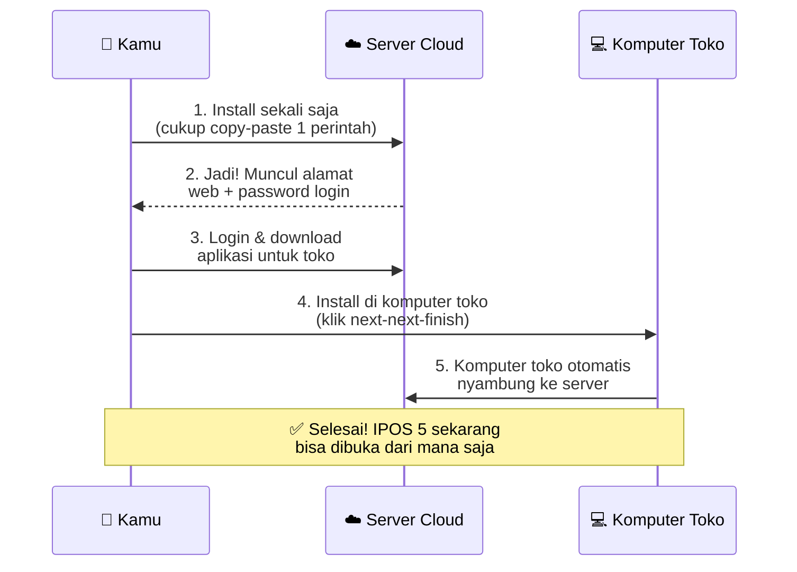
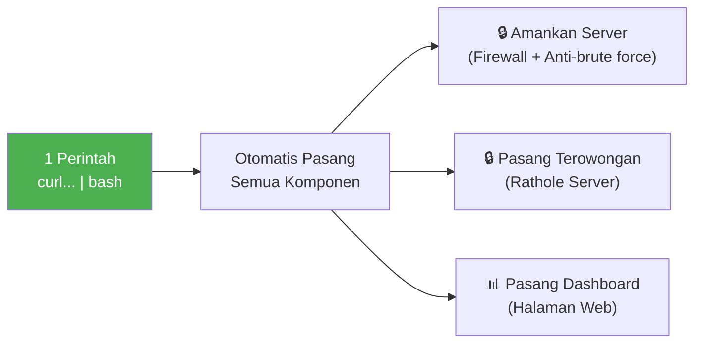
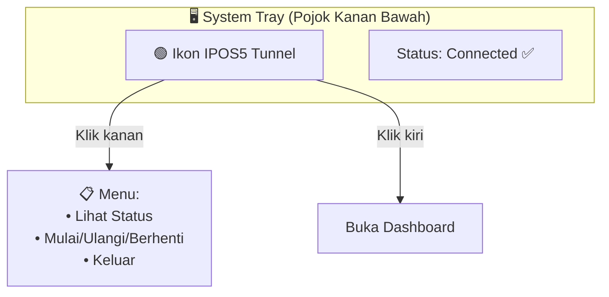
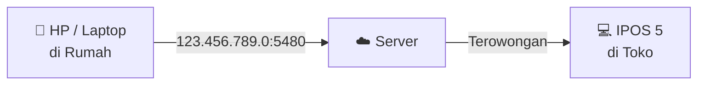
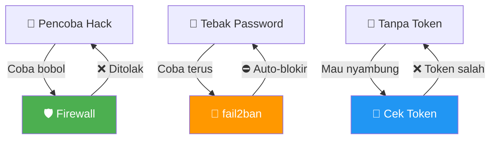
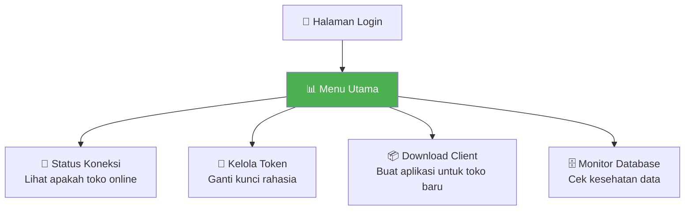
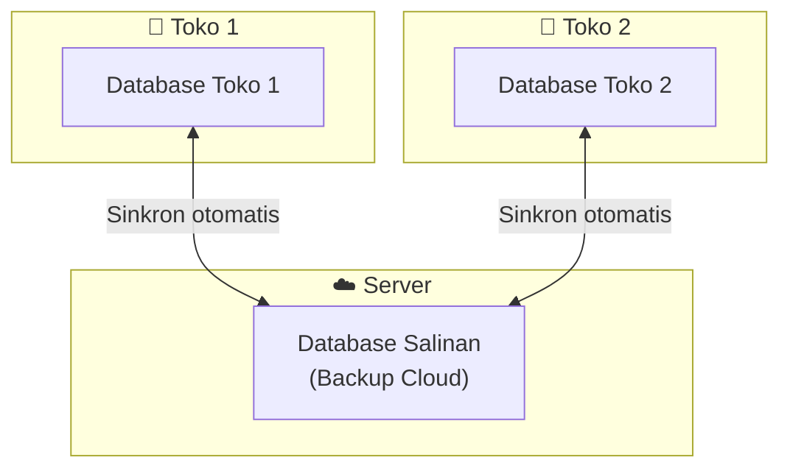

# 🏪 IPOS5TunnelPublik — Akses IPOS 5 dari Mana Saja

## Apa Ini?

Punya **IPOS 5** di komputer toko tapi ingin buka dari rumah atau HP? 

Alat ini membuat IPOS 5 kamu bisa diakses **dari mana saja** — cukup modal VPS murah (sekitar 50-100rb/bulan). Tanpa perlu setting jaringan rumit, tanpa perlu IP publik, tanpa perlu teknisi.

Singkatnya: **sebuah "terowongan rahasia"** yang menghubungkan komputer toko ke internet, aman dan otomatis.

---

## Gambaran Besar



> Komputer toko cukup colok internet biasa. Tidak perlu atur-atur modem atau minta IP publik ke ISP.

---

## Cara Kerja (Versi Sederhana)



---

## Yang Kamu Butuhkan

| Kebutuhan | Keterangan |
|---|---|
| **VPS** | Server cloud murah (Ubuntu 22.04), bisa pakai DigitalOcean, Linode, atau lokal seperti IdCloudHost |
| **Komputer Toko** | Windows 10/11 tempat IPOS 5 terpasang |
| **Internet** | Di toko dan di tempat kamu mengakses (rumah/HP) |

---

## Langkah 1: Pasang di Server Cloud

Cukup jalankan **satu perintah** ini di server:

```
curl -fsSL https://raw.githubusercontent.com/.../public-install.sh | bash
```

Tunggu beberapa menit. Setelah selesai, kamu dapat:

- **Alamat dashboard** (misal: `http://123.456.789.0:8088`)
- **Username & password** untuk login



---

## Langkah 2: Pasang di Komputer Toko

1. Buka dashboard (pakai username & password yang tadi)
2. Klik **"Download Client Windows"** — dapat file ZIP
3. Ekstrak ZIP, jalankan **setup.exe** (klik kanan → Run as Administrator)
4. Selesai. Muncul ikon kecil di pojok kanan bawah layar:



Warna ikon:
- **🟢 Hijau** = Terhubung, normal
- **🟡 Kuning** = Sedang menyambung
- **🔴 Merah** = Gagal (cek internet atau token)

---

## Langkah 3: Akses IPOS 5 dari Mana Saja

Setelah terpasang, buka IPOS 5 dengan alamat:

```
Alamat Server Cloud, port 5480
Contoh: 123.456.789.0:5480
```



Layanan yang bisa diakses:

| Port | Layanan |
|---|---|
| **5480** | IPOS 5 HTTP (aplikasi kasir web) |
| **5485** | IPOS 5 Worker (pemroses data) |
| **5444** | Database PostgreSQL (untuk teknisi) |

---

## Fitur Keamanan

Semua sudah otomatis terpasang:

| Fitur | Gunanya |
|---|---|
| **Token Rahasia (40 karakter)** | Hanya komputer yang punya token yang bisa nyambung |
| **Firewall (UFW)** | Blokir akses tidak dikenal ke server |
| **Anti-Brute Force (fail2ban)** | Blokir percobaan hack yang mencoba password terus-menerus |
| **SSH Hardening** | Amankan akses remote server |
| **Update Otomatis** | Server selalu pakai patch keamanan terbaru |



---

## Fitur Dashboard

Bisa kamu akses lewat browser (HP atau PC):



---

## Opsi Lanjutan: Sinkronisasi Database

Kalau punya lebih dari satu komputer kasir, bisa aktifkan sinkronisasi:



Keuntungan:
- Data aman (ada backup di cloud)
- Semua toko punya data yang sama
- Kalau satu komputer rusak, data tidak hilang

---

## Istilah-istilah

| Istilah | Artinya |
|---|---|
| **VPS** | Komputer sewaan di internet yang nyala 24 jam (sekitar 50-100rb/bln) |
| **Terowongan / Tunnel** | Jalur rahasia yang menghubungkan komputer toko ke server |
| **Token** | Kata sandi panjang (40 karakter) sebagai kunci penghubung |
| **Dashboard** | Halaman web untuk memantau dan mengatur semuanya |
| **Port** | "Pintu" di server untuk tiap layanan (5480 = IPOS, 5444 = database) |
| **Firewall** | Tembok pengaman server dari serangan luar |
| **fail2ban** | Penjaga yang otomatis memblokir orang yang coba-coba masuk |

---

## Butuh Bantuan?

Kalau ada masalah:

1. **Cek dashboard** — lihat status koneksi (hijau/kuning/merah)
2. **Pastikan internet toko nyala** — rathole client butuh koneksi
3. **Coba restart** — klik kanan ikon tray → Restart
4. **Hubungi teknisi kamu** kalau masih bermasalah

---

> Dibuat untuk pemilik usaha yang pakai IPOS 5 dan ingin akses dari mana saja, tanpa pusing urusan jaringan.
